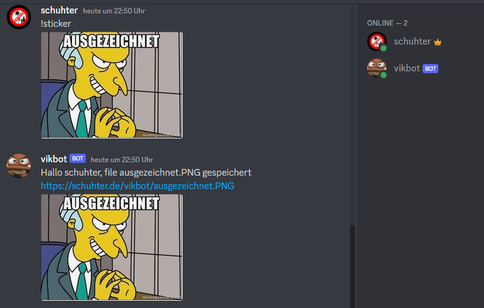

= vikbot

I'm lazy so I want to let someone else do task for me

My Bot can:

- say hello to strangers, but only follow my orders
- upload files to an ftp server for me

== run

you'll need to configer to Environment Variables

* Token of your Discord Bot (https://discord.com/developers/applications)

* List of your "Admins"

* FTP-Credentials

[source,bash]
----
pip install -r requirements.txt
./run.sh
----

== Debug

copy `.envTemplate` to `.env` and fill with your Information

launch.json

[source, json]
----
{
    // Use IntelliSense to learn about possible attributes.
    // Hover to view descriptions of existing attributes.
    // For more information, visit: https://go.microsoft.com/fwlink/?linkid=830387
    "version": "0.2.0",
    "configurations": [
        {
            "name": "Discord Bot",
            "type": "python",
            "request": "launch",
            "program": "src/main.py",
            "console": "integratedTerminal",
            "envFile": "${workspaceFolder}/.env",
            "justMyCode": true
        }
    ]
}
----